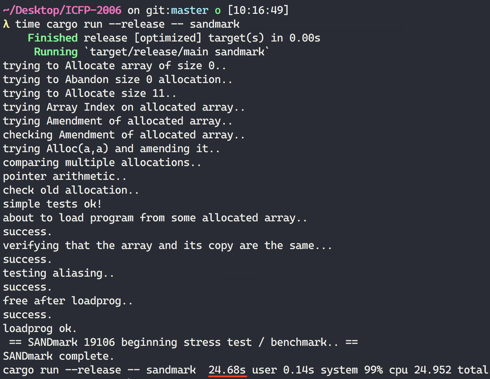

## ICFP-2006
ICFP is a programming competition held each year as part of a conference on functional programming. The 2006 edition is relatively famous and features a virtual machine architecture you have to build a VM for. Once you do you are presented with a full unix shell! The first flags felt more CTF oriented. In this environment are several puzzles. To unlock them you need to find passwords of other users on the system. I found a few of them but they quickly became quite hard and very theoretical so I decided not to continue with this challenge. Put some time into solving the `adventure` puzzle though and building the VM was a fun challenge.

## The VM
I [have](https://github.com/AxlLind/AdventOfCode2019/blob/master/src/intcoder.rs) built [a few](https://github.com/AxlLind/synacor_challenge/blob/master/src/cpu.rs) similar VMs before, so the format was not to difficult. However, the quite feature about this VM was dynamic memory allocation in a way, that I had not seen before in a made up VM like this. It has to instructions `ALLOC` and `FREE`. If you implemented this in C these would simply be implemented by calling `malloc` and `free` respectively. In Rust however, doing your own memory allocation is not that simple without ugly unsafe code.

The `ALLOC` instruction has to return an "id" corresponding to an area of memory, a.k.a in C a simple pointer. The `RMEM` instruction then provides an "id" and an offset. To implement this in Rust, I decided to keep an vector of vectors, where the "id" is the index of the vector and the vector itself is the allocated memory area. Additionally I added a free-list of deallocated vectors that can be reused by future `ALLOC` calls. This means that the VM itself never releases memory but instead reuses it relatively efficiently. This implementation lead to a very fast VM! The challenge provides you with a self-test/benchmark program, which my VM successfully completes in around 25 seconds.

(Some of the output above was removed for brevity)

#### Notes
- Get vm working. Struggled with correct printing of binary data.
- Enter the unix system, you get one flag!
- Prompted to open mail. If you check your inbox again you see another mail which contains another flag.
- Looking at the current directory you see a file `a.out`, running it produces a file `core` which contains another flag.
- Following the instructions in the mail, compiling `hack.bas` does not work. It contains invalid syntax but the problem is we have been provided no way of editing files. After messing around a bit you realize that the program `/bin/umodem` transfers text into a file *to your own machine*. Using this we can copy the whole file `hack.bas` and omit the faulty bits. Now it compiles and we can find the following passwords:
  - howie - xyzzy
  - ohmega - bidirectional
- Logging into `howie` with the password you find an executable, a full text adventure game! `incinerate spring` gives you a flag. Combining `processor` and `cache` gives you a flag.
- After solving the combine puzzle you find `/etc/passwd` which gives you the following passwords:
  - yang - U+262F
  - hmonk - COMEFROM
- Solving hmonk gives you:
  - gardener - mathemantica
